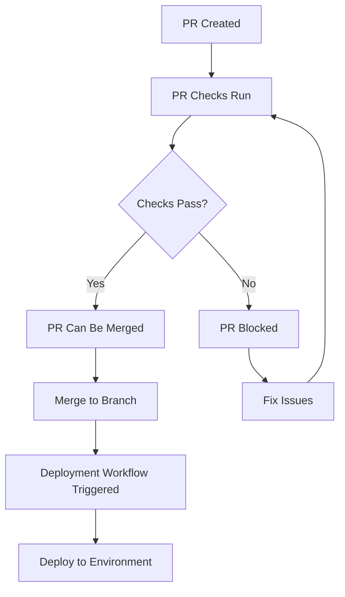

# 🌿 Branch Protection Rules Configuration

This document outlines the recommended branch protection rules for implementing proper workflow dependencies and ensuring code quality.

## 🎯 Overview

Branch protection rules ensure that:

- PR checks must pass before merging
- Deployments only happen after successful PR checks
- Code quality standards are maintained
- Hotfixes can be deployed when necessary

## 📋 Recommended Branch Protection Rules

### 1. **Main Branch (Production)**

```yaml
# Repository Settings > Branches > main
Required Status Checks:
  - ✅ Require status checks to pass before merging
  - ✅ Require branches to be up to date before merging
  - ✅ Require status checks to pass before merging
  - ✅ Require pull request reviews before merging
  - ✅ Dismiss stale PR approvals when new commits are pushed
  - ✅ Require review from code owners

Status Checks Required:
  - 🔍 Pull Request Checks (pr-checks.yml)
  - 🚀 Deploy to Production (deploy-production.yml)

Restrictions:
  - ✅ Restrict pushes that create files larger than 100MB
  - ✅ Require linear history
  - ✅ Include administrators
  - ✅ Allow force pushes: ❌ NO
  - ✅ Allow deletions: ❌ NO
```

### 2. **Staging Branch**

```yaml
# Repository Settings > Branches > staging
Required Status Checks:
  - ✅ Require status checks to pass before merging
  - ✅ Require branches to be up to date before merging
  - ✅ Require pull request reviews before merging

Status Checks Required:
  - 🔍 Pull Request Checks (pr-checks.yml)
  - 🎭 Deploy to Staging (deploy-staging.yml)

Restrictions:
  - ✅ Restrict pushes that create files larger than 100MB
  - ✅ Include administrators
  - ✅ Allow force pushes: ❌ NO
  - ✅ Allow deletions: ❌ NO
```

### 3. **QA Branch**

```yaml
# Repository Settings > Branches > qa
Required Status Checks:
  - ✅ Require status checks to pass before merging
  - ✅ Require branches to be up to date before merging

Status Checks Required:
  - 🔍 Pull Request Checks (pr-checks.yml)
  - 🧪 Deploy to QA (deploy-qa.yml)

Restrictions:
  - ✅ Restrict pushes that create files larger than 100MB
  - ✅ Include administrators
  - ✅ Allow force pushes: ❌ NO
  - ✅ Allow deletions: ❌ NO
```

### 4. **Dev Branch**

```yaml
# Repository Settings > Branches > dev
Required Status Checks:
  - ✅ Require status checks to pass before merging
  - ✅ Require branches to be up to date before merging

Status Checks Required:
  - 🔍 Pull Request Checks (pr-checks.yml)
  - 🚀 Deploy to Development (deploy-dev.yml)

Restrictions:
  - ✅ Restrict pushes that create files larger than 100MB
  - ✅ Include administrators
  - ✅ Allow force pushes: ❌ NO
  - ✅ Allow deletions: ❌ NO
```

## 🔧 Implementation Steps

### Step 1: Configure Branch Protection Rules

1. Go to your repository on GitHub
2. Navigate to **Settings** > **Branches**
3. Click **Add rule** for each branch
4. Configure the rules as specified above

### Step 2: Set Up Required Status Checks

1. In each branch protection rule
2. Enable **Require status checks to pass before merging**
3. Select the appropriate workflows from the list
4. Enable **Require branches to be up to date before merging**

### Step 3: Configure Code Review Requirements

1. Enable **Require pull request reviews before merging**
2. Set minimum number of reviewers (recommended: 1-2)
3. Enable **Dismiss stale PR approvals when new commits are pushed**
4. Enable **Require review from code owners** (if you have CODEOWNERS file)

### Step 4: Test the Workflow

1. Create a test PR to any protected branch
2. Verify that PR checks must pass before merging
3. Verify that deployment workflows only run after successful PR checks

## 🚨 Emergency Override

For emergency situations, you can:

### Option 1: Manual Workflow Dispatch

```bash
# Trigger deployment manually via GitHub CLI
gh workflow run deploy-production.yml --ref main
```

### Option 2: Admin Override

- Repository admins can override branch protection rules
- Use with caution and document the reason

### Option 3: Hotfix Branch

```bash
# Create hotfix branch from main
git checkout main
git pull origin main
git checkout -b hotfix/critical-fix
# Make changes and push
git push origin hotfix/critical-fix
# Create PR to main with emergency label
```

## 📊 Workflow Dependencies Flow



## 🔍 Monitoring and Alerts

### GitHub Actions Insights

- Monitor workflow success rates
- Track deployment frequency
- Identify common failure patterns

### Notifications

- Set up Slack/email notifications for:
  - Failed PR checks
  - Successful deployments
  - Failed deployments
  - Security alerts

### Metrics to Track

- PR check pass rate
- Deployment success rate
- Time from PR to deployment
- Rollback frequency

## 🛠️ Troubleshooting

### Common Issues

1. **Workflow not triggering after PR merge**
   - Check if `workflow_run` trigger is correctly configured
   - Verify workflow names match exactly
   - Check branch names in trigger configuration

2. **Deployment failing after successful PR checks**
   - Check environment secrets are configured
   - Verify deployment permissions
   - Check deployment scripts for errors

3. **PR checks not running**
   - Verify workflow file syntax
   - Check if workflow is enabled
   - Verify trigger conditions

### Debug Commands

```bash
# Check workflow status
gh run list --workflow="pr-checks.yml"

# View workflow logs
gh run view <run-id> --log

# Check branch protection status
gh api repos/:owner/:repo/branches/:branch/protection
```

## 📚 Additional Resources

- [GitHub Branch Protection Rules](https://docs.github.com/en/repositories/configuring-branches-and-merges-in-your-repository/defining-the-mergeability-of-pull-requests/about-protected-branches)
- [GitHub Actions Workflow Triggers](https://docs.github.com/en/actions/using-workflows/triggering-a-workflow)
- [GitHub Actions workflow_run](https://docs.github.com/en/actions/using-workflows/events-that-trigger-workflows#workflow_run)
