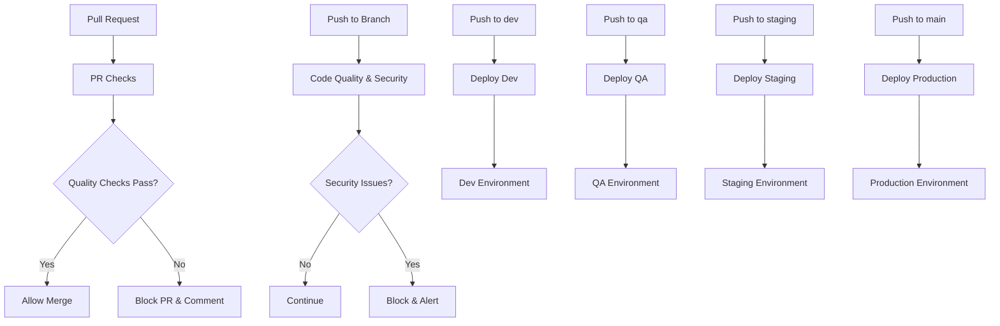

# 🚀 GitHub Actions CI/CD Pipeline

This directory contains GitHub Actions workflows for automated testing, quality checks, and deployment across different environments

## 📋 Workflow Overview

### 🔍 Pull Request Checks (`pr-checks.yml`)

- **Triggers**: Pull requests to `main`, `dev`, `qa`, `staging`, `feature/gh-actions`
- **Purpose**: Comprehensive quality assurance for PRs
- **Features**:
  - ESLint analysis with JSON reporting
  - Prettier formatting checks
  - TypeScript type checking
  - Unit tests with coverage (Node 18 & 20)
  - Build verification
  - Bundle analysis and performance budget checks
  - Security audit (moderate level)
  - Secrets scanning
  - Dependency vulnerability scan
  - Coverage reporting to Codecov
  - PR comments with detailed results
  - Artifact uploads for build files and reports

### 📏 Code Quality & Security (`code-quality.yml`)

- **Triggers**: Push to `main`, `dev`, `qa`, `staging`, `feature/gh-actions` + Weekly schedule (Monday 2 AM)
- **Purpose**: Continuous code quality monitoring and security scanning
- **Features**:
  - All PR check features plus:
  - Higher security audit level (high)
  - Environment variable usage checks
  - Weekly scheduled security scans
  - Failure notifications for security issues
  - Comprehensive quality reporting

### 🚀 Development Deployment (`deploy-dev.yml`)

- **Triggers**: Push to `dev` branch
- **Purpose**: Deploy to development environment
- **Features**:
  - Quality checks (lint, format, type-check, tests)
  - Development build with environment variables
  - Bundle analysis
  - Deployment to dev server
  - Development team notifications

### 🧪 QA Deployment (`deploy-qa.yml`)

- **Triggers**: Push to `qa` branch
- **Purpose**: Deploy to QA environment
- **Features**:
  - Comprehensive quality checks
  - QA build with Sentry monitoring
  - Security audit (moderate level)
  - E2E test execution
  - QA team notifications

### 🎭 Staging Deployment (`deploy-staging.yml`)

- **Triggers**: Push to `staging` branch
- **Purpose**: Deploy to staging environment
- **Features**:
  - Production-level quality checks
  - Staging build with monitoring
  - High-level security audit
  - Smoke tests
  - Stakeholder notifications

### 🚀 Production Deployment (`deploy-production.yml`)

- **Triggers**: Push to `main` branch
- **Purpose**: Deploy to production
- **Features**:
  - Production quality checks
  - Production build with monitoring
  - High-level security audit
  - Release tagging
  - GitHub release creation
  - Production notifications

## 🔧 Environment Variables

### Required Secrets

Set these secrets in your GitHub repository settings:

#### Development

- `DEV_API_URL`: Development API endpoint

#### QA

- `QA_API_URL`: QA API endpoint
- `QA_SENTRY_DSN`: QA Sentry DSN

#### Staging

- `STAGING_API_URL`: Staging API endpoint
- `STAGING_SENTRY_DSN`: Staging Sentry DSN

#### Production

- `PROD_API_URL`: Production API endpoint
- `PROD_SENTRY_DSN`: Production Sentry DSN

## 🏗️ Deployment Environments

### Development (`dev` branch)

- **Purpose**: Development testing
- **Deployment**: Automatic on push
- **Features**: Basic quality checks, dev build

### QA (`qa` branch)

- **Purpose**: Quality assurance testing
- **Deployment**: Automatic on push
- **Features**: Full quality checks, E2E tests, monitoring

### Staging (`staging` branch)

- **Purpose**: Pre-production testing
- **Deployment**: Automatic on push
- **Features**: Production-level checks, smoke tests

### Production (`main` branch)

- **Purpose**: Live production environment
- **Deployment**: Automatic on push
- **Features**: Full production checks, release tagging

## 📊 Monitoring & Notifications

### Coverage Reporting

- **Codecov**: Automatic coverage reporting for all workflows
- **Multi-Node Testing**: Coverage tracked for Node 18 & 20
- **Reports**: Available in PR comments and artifacts
- **Upload**: Automatic upload on every test run

### Security Monitoring

- **PR Checks**: Moderate-level security audits on every PR
- **Code Quality**: High-level security audits on pushes + weekly schedule
- **Dependency Audit**: Comprehensive vulnerability scanning
- **Secret Scanning**: Prevents secret commits in source code
- **Environment Checks**: Validates environment variable usage

### Quality Metrics

- **Bundle Size**: Monitored and reported with performance budget checks
- **Performance**: Bundle analysis and size tracking
- **Code Quality**: ESLint analysis with JSON reporting, Prettier formatting, TypeScript analysis
- **Test Coverage**: Multi-version testing with detailed coverage reports
- **Artifacts**: Build files and quality reports stored for 7-30 days

## 🚨 Failure Handling

### Test Failures

- **Action**: Block deployment
- **Notification**: PR comments, team notifications
- **Resolution**: Fix issues and re-run

### Security Issues

- **Action**: Block deployment for high/critical issues
- **Notification**: Security team alerts
- **Resolution**: Update dependencies, fix vulnerabilities

### Build Failures

- **Action**: Block deployment
- **Notification**: Developer notifications
- **Resolution**: Fix build issues and re-run

## 🔄 Workflow Dependencies

## 📝 Customization

### Adding New Environments

1. Create new workflow file (e.g., `deploy-custom.yml`)
2. Add environment-specific secrets
3. Configure deployment steps
4. Add to branch triggers

### Modifying Quality Checks

1. Update workflow files
2. Add new check steps
3. Configure failure conditions
4. Update notifications

### Adding Notifications

1. Configure notification services (Slack, email, etc.)
2. Add notification steps to workflows
3. Set up environment-specific notifications

## 🛠️ Troubleshooting

### Common Issues

- **Node.js version conflicts**: Check matrix strategy
- **Cache issues**: Clear GitHub Actions cache
- **Secret not found**: Verify secret names and permissions
- **Build failures**: Check environment variables

### Debug Steps

1. Check workflow logs
2. Verify environment variables
3. Test locally with same Node.js version
4. Check dependency versions

## 📚 Resources

- [GitHub Actions Documentation](https://docs.github.com/en/actions)
- [Node.js Setup Action](https://github.com/actions/setup-node)
- [Codecov Action](https://github.com/codecov/codecov-action)
- [Security Best Practices](https://docs.github.com/en/actions/security-guides)
